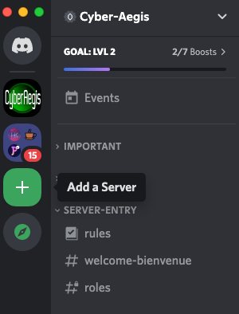
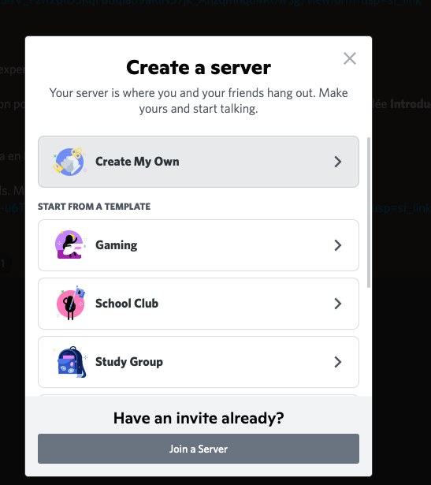
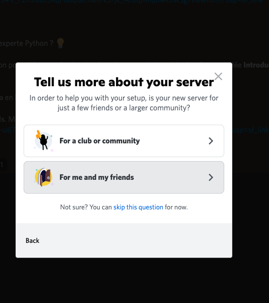
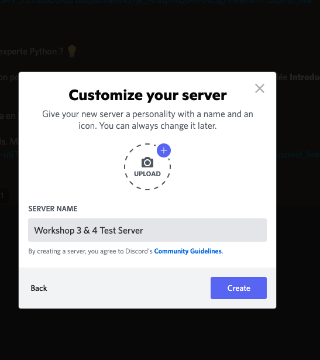
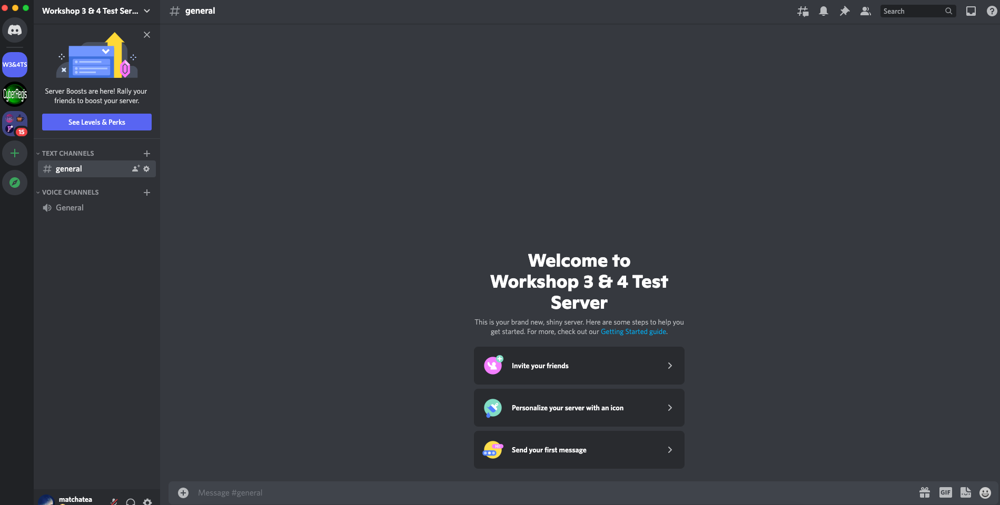

### Workshop 3 & 4 Pre-requisite Requirements:

These are some pre-requisite requirements before we dive into Workshops 3 & 4. There will be flags as you continue along in this tutorial. For any questions or clarifications, use the Cyber Aegis discord workshop help channel to share your questions. Thank you!

---
### Homework Checklist

- [ ] Create a Discord Server
- [ ] Create a Discord Bot and Set Permissions
- [ ] Generate Discord Bot API Key
- [ ] Store your API Key in a .env file

---
### How to Create a Discord Server 

- [ ] Open the discord application on your machine
- [ ] Navigate to the left side and hover over the + icon, it will say "Add a Server".
- [ ] Click "Add a Server".

- [ ] A window will pop up to show these options, choose the Create My Own without a template.

- [ ] Select the server option "For me and my friends".

- [ ] Create a name for the Discord server, name it whatever you want.

- [ ] Your new Discord server show be created. 🎉 🎉 🎉

- [ ] Enter the flag 
`flag{created_a_server}`

---
### Create a Discord Bot and Set Permissions

---
### Generate Discord Bot API Key

---
### Store your API Key in a .env file

---
